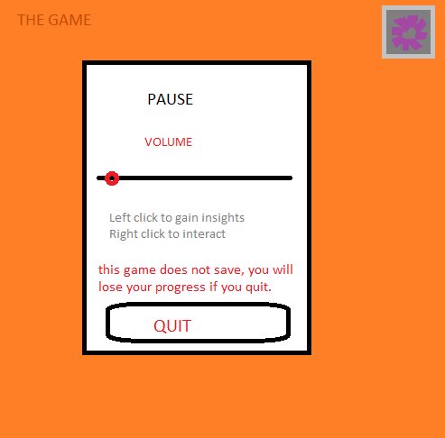

Conner Crawford

Game Design Document

**Game Design Club**

01.28.2019

UofC GDC

# OVERVIEW

Conner Crawford is a game about the world of 11-year-old boy Conner Crawford who finds a time machine in his bedroom. This point-and-click is about solving puzzles and learning through environment. Guide Conner through his pixel art adventure of mind-boggling time travel, child-like excitement, and Game Design Club levels of fun.

# GAMEPLAY

## Game View

**Art**

The game features and Isometric 2D Pixel Art Style. Isometric means there are no perspective lines or foreshortening effects. "It is an axonometric projection in which the three coordinate axes appear equally foreshortened and the angle between any two of them is 120 degrees" - from wikipedia for the even more technical explanation. Important lines are vertical lines that represent height and are always perfectly straight up and down. The West, North, East, South walls are on at angles 45°, 135°, 225°, 315° respectively. See figure 2 for isometric view example. The game also features a 2D pixel art style. This means our visual assets made up of 2D sprites with of small pixel widths and heights. See figure 3a and figure 3b for examples of 2D art style. 

**What’s on screen**

The game can be thought of in 3 layers. Firstly, the game layer. Where all the diegetic elements lie. The second layer is one above it contains the UI like the pause menu and pause menu button. Note that in this world Conners speech bubbles are diegetic, not UI. Lastly, a third layer serves to cover both the world and game elements for purposes like scene transitions. 

### Diegetic Layer

See figure 1. Note that the wall with the door is the northmost and the west wall is the wall with the clock on it.

### UI Layer

This layer includes the Pause Menu button, a square button branded with a widget icon. This layer also includes the user's *cursor*. A sprite to represent their mouse position on screen.

### Light sources and states

There are 3 important light sources in the game. Conner’s room light, light from Conner’s window (on his East wall), and the hallway light coming from the door. These 3 variables define light data in the scene. Conner’s room light is done through a directional light in Unity, the time of day (day/night) is done through pallets / the objects color, the door is a light source through code rather than visuals. The door includes a small amount of ‘light’ coming through the crack of the open door. When all three of these sources are not letting light through the game enters complete darkness achieved through a shader covering the screen in darkness with the exception of your cursor when equipped with the flashlight which allows you to see through the darkness and the glow in the dark constellations that glow through the dark. To see all the light source options and their effects refer to this chart:

<table>
  <tr>
    <td>Room Light</td>
    <td>Day Time</td>
    <td>Door State</td>
    <td>Darkness Level</td>
  </tr>
  <tr>
    <td>On</td>
    <td>Day</td>
    <td>Open</td>
    <td>Direction Light On, Daytime Pallet.</td>
  </tr>
  <tr>
    <td>On</td>
    <td>Day</td>
    <td>Closed</td>
    <td>Direction Light On, Daytime Pallet.</td>
  </tr>
  <tr>
    <td>On</td>
    <td>Night</td>
    <td>Closed</td>
    <td>Direction Light On, Night Pallet</td>
  </tr>
  <tr>
    <td>Off</td>
    <td>Day</td>
    <td>Closed</td>
    <td>Direction Light Off, Daytime Pallet</td>
  </tr>
  <tr>
    <td>Off</td>
    <td>Night</td>
    <td>Open</td>
    <td>Direction Light Off, Night Pallet</td>
  </tr>
  <tr>
    <td>Off</td>
    <td>Night</td>
    <td>Closed</td>
    <td>Pure Darkness, Night pallet, Direction Light Off</td>
  </tr>
</table>

## Puzzles

The games progression follows a typical point and click adventure very similar to an escape room. By paying close attention to your environment, using creative thinking, and combining and using items in the right order will bring you further to the end of the game. The solution to the game can be found under figure 6.

## Conner and World

Along with time traveling and solving puzzles, you get to know the main playable character, Conner Crawford. The insights provide for each object come from Conner himself. Through his diction, vocabulary, and emotions on every object in his room you learn about how Conner sees the world. Since the game is through the eyes of an 11 year old, the tone is light and humorous. Exaggeration is a key feature in putting the player in the shoes of an 11 year old - so large sound effects, disproportionate art, and spectacular special effects are all encouraged. Some key details on Conner and the world follow:

Conner: is in grade 5. Likes baseball. Lives on 64 Olive Court. Wants to be a MLB All Star. Loves sci fi books, films, and comics. Enjoys writing stories in his spare time. Loves his soccer-mom type mom and his can fix anything pun filled dad. Has a younger sister age 6. Is jealous of the sport loving try hard Jacob Rodriguez in his class. Has a best friend named Omar Adams. Was born August 22, 1994. His favorite food is peanut butter. Conner treasures his gameboy and his favorite game is Pokemon (or some in-game equivalent so we don’t get sued.). Conner likes the movie E.T. 

The game takes place in the year 2005. The game takes place on 64 Olive Court.

## Story

In Conner Crawford, Conner comes home from a normal day of school to discover his room in a state of disarray, and a strange machine in the middle of his bedroom. Upon further inspection of the mystery he comes to realize the machine is a time machine. Excitedly Conner travels back in time where he finds himself trapped in his own bedroom. Conner races to escape the confines he accidently created for himself, before his past self came back: which would surely cause a paradox and destroy the world. In Conner’s escape he ends up setting the room to the state of disarray that caused this whole event, along with being the reason the time travel machine was in his own room. Narrowly avoiding his doom Conner escapes only to hear the loop begin again. As his past self travels back in time Conner is finally safe to re enter his room just in time for dinner.

## Interaction

The game world is interacted with entirely through mouse interaction. 

### Left-Click

The most basic interaction comes from left-clicking objects in the room. When the object in question is intractable Conner will make his way over to it, and provide an *insight* on the object. (see core features below). 

You can also to interact with the pause button and menu, as well as click the next button found on some insights.

### Right-Click

The secondary interaction comes from right-clicking objects in the room. When no action is available, the cursor 

## Core Features

### Insights

When an object is left-clicked Conner will make his way over to it, and provide an *insight* on the object. An insight is a speech bubble that appears above Conner’s head. It gets filled with text overtime, providing the illusion of Conner speaking. Often one speech bubble is not enough detail for one object so a next button can be found at the bottom of the speech bubble when their is more text in the insight. An object is not limited to just one insight. Multiple insights may be available for an object and chosen at random.

### Day Night Progress

The game’s story full progresses through in game time 8:25am to 7:30pm. As such we have two game states, day and night. The intro cutscene begins 8:25am (morning) and cuts to 4:45pm night time. You play in night time till you go back in time to morning again where it is morning. After successfully setting the radio frequency to 44.3fm en route to escape his own bedroom Conner notes how late it’s getting and night falls. The clock changes time to 4pm and we switch to the night pallet where the rest of the game is played.

### 3D Inspection and Interaction

Certain objects interaction trigger a 3D inspection mode. In this mode a 3D object is brought on screen in between the game and UI layer. Here objects have special interactions: such as placing the battery in your inventory into a radio battery slot, flipping breaker switches, and rotating safe locks. You can exit this view at any time by clicking off of the object.

### Inventory

The game has a few key items that can be picked up. When your inventory slot is empty and you interact with an item that gives you an item then your inventory is filled with this item and your cursor will change to include a paper symbol when full. You may only hold 1 item in your inventory/cursor at a time.

### Cursor

The game features a custom cursor to aid with feedback to the user. Other than denoting the users mouse position, it flashes red when an object right clicks a object with no interaction and has a paper symbol 

### Star Puzzle

Once you have unlocked the time machine you when interacting with it enter a minigame. Your screen is filled with stars. Clicking on the start star (the larger brighter one) every next star you click connects the previous star to the clicked star by a line. Using this you can create constellations. You pass when you create the 2 constellations found on the walls of conners room that can only be seen while in complete darkness. See figure 7 for more details. 

## Cutscenes

The game contains two major cutscenes. A cutscene is distinguished from a game segment by the *lack of player control*. The first cutscenes aids as intro and tutorial of the game. The second cutscene concludes the game and outros to the credits.

### Intro Cutscene:

Fade from splash screen to black. Fade from black to Conner’s room (Clean State). Conner breaks the fourth wall and explains he must go to school, but first teaches you the basic game mechanics. In this mode you can only click next on the speech bubbles. Conner exits his room. Fade to black. Fade to Conner’s room (Messy State). Conner enters his room and remarks on the state. Player control is now available. See Intro Dialougue Content for the script in this section.

### Outro Cutscene:

	This cutscene is triggered as Conner exits his room after traveling back in time. Fade to black. While on black we hear any notable sounds involved in the first segment of the game, including the time travel. Fade from black. The room should now be in the exact state the player had left it moments before traveling back in time, with the exception of the missing Manual, Time Machine, and Flashlight. Conner enters the room and remarks on his adventure. A higher pitched voice similar to Conner’s is heard to which Conner replies. The title fades on screen and stays as the game fades to black. The title scrolls upward followed by upward scrolling credits. Once all credits have scrolled off the screen the game will close. 

## Game Start and End

The game can be started by double-clicking the executable. Watching through the splash screen(s) and intro cutscene.

The game can be quit in two separate ways.

1. By entering the options menu (See pg__.) and selecting Quit.

2. By completing the game and watching through the final cutscene and credits sequence. 

## Notable Room States

While between these specific states the game is some flux state while the user solves the puzzles.

**Clean**

This denotes the point in time immediately after the earliest chronological Conner we see leaves for school at 8:25am at the end of the intro cutscene and immediately before Conner (approx. midgame) appears by using the time machine at 8:30am. This state is defined by:

* Door closed and locked

* Lights are on

* No note on floor by door

* Lamp off

* There is no flashlight, manual, or time machine

* Breaker is closed and fine

* Safe closed

* Radio on staticky - contains one battery

* Day time

**Dirty**

This denotes the point in time immediately before the earlier Conner returns home from school at 4:45pm and immediately after the later Conner exits the room at 4:44pm. This state is defined by:

* Note on Floor in front of Door

* Flashlight in room

* Radio has 1 Battery (it should have 2, we’re ignoring this for playability)

* The flashlight has 0 batteries

* Flashlight is placed where it started

* Radio set to Lamp Frequency [Fuzzy from 1 battery]

* Breaker Box Open

* Breaker Switches are all off (the solution should be flipped, ignore for playability)

* Breaker Box is Broken

* Power is out, Lights are Off

* Safe is Open

* Key is Missing

* Door is Open

* Night time.

**Moment of Time Travel**

This denotes the point in time immediately after the earlier Conner (approx. midgame) uses the time machine (7:25pm) and immediately before the oldest Conner re-enters his room during the outro cutscene (7:30pm). This state is seen first while user has full game control, meaning the state is whatever the state of the room is when the player time travels. During the outro cutscene when the eldest Conner re-enters the room, the room is just set back to whatever this state was. 

# OBJECTS

**2D **

**[Please see: ****[Art2D TOD**O](https://docs.google.com/spreadsheets/d/1TuKNC6VhhpSOUZ53HhjtOBtzWK9Xot7W42XROrzLPns/edit?usp=sharing)** for ****_working _****on any of these assets!****]**

**[See figure 1 for a more comprehensive picture of the room.]**

Radio [Has 3D]

* Should not look wholly different than 3D version.

* Music notes play out of the radio

* The radio ‘speaks’ like Conner but comes through staticky unless there are two batteries in the radio. 

* When the radio is set to 44.3fm the radio ‘speaks’ the code 4239

* When the radio is set to 44.3fm conner says: "It’s getting really late" and the clock spins to 4pm and we switch to the night palette.

* Optional* 3 states: On, half power, off

* INTERACTION:

    * Opens into 3D view.

Flashlight

* INTERACTION:

    * Turns your cursor into a flashlight

    * Adds the flashlight above your head.

    * When combined with the blue paper item found in the desk your cursor flashlight turns blue. This is used to read the red text found in the manual.

Time Travel Machine

* *Optional two states: Ready and Not Ready

* INTERACTION:

    * When not set up right clicking does nothing, you must right click and hold for exactly 3 seconds.

    * Once this is done you can right click to enter the star puzzle

    * Once you have completed the star puzzle right clicking travels you back in time.

Door

* Locks from the outside

* Two states: Opened and closed.

* Has pouch on room side

* INTERACTION:

    * While the door is unlocked: Opens / Closes the door.

    * While the door is locked and hasn’t been interacted with: Drops the note onto the floor

    * While the door is locked and note is found: Does nothing

Lamp

* Has lampshade

* Two states, on and off

* When turned on 44.3fm can be seen sharpied into the lamp shade

* When turned off that code cannot be seen

* INTERACTION:

    * While the power is on: Turns on and off

    * While the power is off: Does nothing

Breaker Box [Has 3D]

* Should not look wholly different than the 3D model

* Optional* Two states: open and closed

* Optional* Don’t touch note. from Mom

* Optional* Broken and not broken

* When breaker switches 4, 2, 3, and 9 are all flipped to on, the breaker box breaks and the power goes off. This means the lamp is off and cannot be turned on, the room light is off and cannot be turned on. 

* INTERACTION:

    * Opens into 3D view

Toy Safe [Has 3D]

* Should not look wholly different than the 3D model

* *optional Two states: Open and Closed

* Holds the key to the door

* INTERACTION:

    * When locked opens into 3D view

    * When unlocked adds key to inventory

Bed

* Has a rocketship cover

Chair

* Sits in front of desk

Fish

* His name is Pascal  :3

Clock

* Clock face and two hands. Animated in Unity.

* Will show the time in game. It shows:

    * 8:25am during intro

    * 4:45pm when Conner comes back home

    * Spins to 5:36 when blue flashlight is gained

    * Spins to 5:43 when Manual is read.

    * Spins to 7:20pm once you’ve entered the constellations 

    * Is at 8:30am after traveling back in time

    * Spins to 10:22am once Conner tries the locked door

    * Spins to 12:14pm once Conner reads the door note

    * Spins to 2:06pm once Conner turns on the lamp

    * Spins to 4:00pm once Conner sets the radio to 44.3fm

    * Spins to 4:10 once Conner breaks the breaker

    * Spins to 4:20pm once Conner opens the safe 

    * Spins to 4:30pm once Conner gets the safe key

    * Spins to 4:40pm once Conner opens the door

    * Is at 7:30pm when you re enter the room in outro

Shelves

* Hold Figurines & Origami

Glow in the Dark Stars

* Form constellations when the room is in complete darkness- are just the stars otherwise. See figure 7.

Note

* Form constellations when the room is dark - are just the stars otherwise.

* INTERACTION:

    * Makes the Manual ‘speak’ like Conner, however the text and background are red.

**3D**

3D objects are not in a pixel art style, allowing them to give deeper level of detail and understanding to objects in Conner’s room.

Radio

The radio is can be rotated around it’s up axis by clicking and dragging left and right. The radio can be rotated 360°. The radio has it’s battery compartment open and has 2 battery slots. The radio starts (start of the game) with one battery. It’s built using 3 Meshes: 1 Battery, 2 Battery, 0 Battery. There is a frequency slider on the radio. The 3D export should include the needle as a separate object. See figure 4 for an example.

Breaker Box

The breaker box cannot be rotated and is only seen from one view. However, each switch in the breaker box should be rotatable and a exported as a separate object. By clicking on any breaker box switch it will flip. Each switch has a number to the left of it and contains a piece of tape tapped with a letter on it only visible when the switch is in the ‘on’ position. See figure 5 for a drawn diagram of this object.

Toy Safe

The toy safe cannot be rotated and is only seen from one view. However it contains a rotatable letter wheel. The 3D export should include the combo wheel as a separate object. The wheel includes letters ‘a’ to ‘o’. 

# UI

	The UI consists of a pause menu, a credits sequence, and a few fade ins, fade outs, and vfx that use Unity’s UI system. The pause menu can be accessed during the game by clicking on the gear icon in the upper left corner of the screen. The pause menu will appear on screen and consist of a volume slider, some text explaining the controls, and a Quit button. You can exit this menu at any time by clicking anywhere outside the menu. See figure 8 for a picture.

# MUSIC AND SOUND

### Conners Voice

Conners' voice is synthesized by playing a sound every frame a letter appears on screen, and abstaining from such during white spaces. 

### Moms Voice

Moms voice is synthesized the same way though, without any letters actually appearing on screen. Moms voice is at a higher pitch.

### Sound Effects

A number of critical moments in the game can be greatly emphasized with sound effects. Importantly the time travel machine usage, the breaker box short circuiting, the radio producing sounds, clock hands spinning forward. 

### Soundtrack

The game has an optional soundtrack to be further discussed with Caelum and David. If you are interested in this aspect please talk to one of us or message us on Slack.

### Soundscape

The game has the option of many different sounds to further environment. Ideas include birds, house sounds and creaks, music from the radio, etc. If you are interested in contributing to this section contact Caelum so that he can plan what design and programming jobs should be allocated as well as any notes on the general sound effect and then go for it!

### Credits

The credits wrap the whole game and provide a space for reflection. A musical element that also concludes the game, and summarizes the experience would be greatly beneficial.

# FIGURES

**Figure 1: Basic Room Concept. **

Here we see a recreation of what the camera will see in the final game.

These walls are internally cardinally labeled with North being the door wall

**Figure 2: Isometric view example.**

In iso depth lines are parallel and will never touch.

**Figure 3a: Pixel Art Example 1.**

**Figure 3b: Pixel Art Example 2.**

**Figure 4: Example of 3D Radio.**

**Figure 5: Breaker Box Drawn Diagram.**

**Figure 6: Game Solution**

**Figure 7a: Star Pattern: Ursa**

**Figure 7b: Star Pattern: Scorpion**

**Figure 8: Pause UI**

# DIALOGUE CONTENT

Insights are stored in scriptable objects with the following data: 

A List of structs. This represents the insight sequence for this object. Objects can have more than one of these scriptable objects, in which case one is chosen at random.

Each struct holds the following data, and represents one filled speech bubble

The text (string) data and the Text mesh pro formatting used.

Intro

	Hi! I’m Conner!

	I’ve got to go to school, but I’ve got a little more to say.

	To continue on a subject, click the arrow.  → 

	Great! → 

	Left click on objects in my room to have me inspect them. → 

	and right click to have me interact with them. → 

	I’d practice with you, but I’m late for school!

	[Leaves for school]

	[Returns from school]

	Whoah! What happened here? and What is *that*?

Outro

	Oh man that was a close one…

	Let's do that again!

	[Off screen mom voice]

	Be right down mom!

Pascal

What do you call a fish with no eyes? → 

Fssssshhhhhhhhhh

Want some food buddy?

Pascal?→ 

More like…→ 

Pastel!→ 

Get it? Because of the game’s color pallet?

Door

That’s just my door. x7

Have you not seen a door before?

*I don’t think he’s seen a door before.*

Desk

This is where I get all of my construction paper but I don’t do a lot of crafts anymore.

I’ve got so much colored paper. Who needs that much blue paper?!

Lamp

That’s my lamp. It’s boring but I like to wear the lampshade as a hat hehehe.

Lightswitch

	Before trying it dark 

	I don’t remember turning off my lights

	After trying it dark

	The power must be out

	Else

	Ah, my good old… → 

... lightswitch

Manual

Well this is a weeeeird book. All of the pages are red! 

I feel like it has letters the page is bumpy. It’s too dark though

If I could find the right light, I could see the writing

Stars

My stars are the coolest. I’m going to be an astronaut and work at NASA

Flashlight

What is this flashlight doing here?! → 

Mom keeps this in the cupboard so I don’t use up aaall the battery.

Breaker Box

I’m really not allowed to touch that or mom gets mad. It’s just a bunch of boring switches anyway.

Mom didn’t have to put a note on it, I can remember on my own

Closet

My clothes and rock collection are in here

I come here to get dressed every morning 

Radio

This is my radio and it’s so cool because I-uh, I can listen to all the stations → 

and even uh and it connects to my walkie talkie

Figurine 1

Pshewww waaa. I love you collectors edition Yoba. 

Origami 1

Oh man I remember when I played Furyfold. Origami is so cool!

Trash Bin

hmm. I should prooooobably take that out…

Bed

I can’t go to bed, I haven’t even had dinner!

Bed time!! NO please just a few more minutes

I think there’s more important things to do right now

Drawers

I think there’s an old lunch box in there somewhere. →

*Sniff* *Snif* → 

Yep. Pee-ew. Definitely an old lunch in there.

Clock

Look at the time!

Hey look, it’s the time.

What time is it Mr. Wolf?

How long has it been since I had lunch?

Hickory Dickory Clock

Time Machine

It’s like a big old pot

I wonder how it works

Beep boop

What exactly is this thing?

Just what I’ve always wanted → 

A. Uhhhh. What is this thing?

Conner

Huh. I’m squishy.

Boop

Hehe that tickles!

…

Chair

The best chair that money can buy

